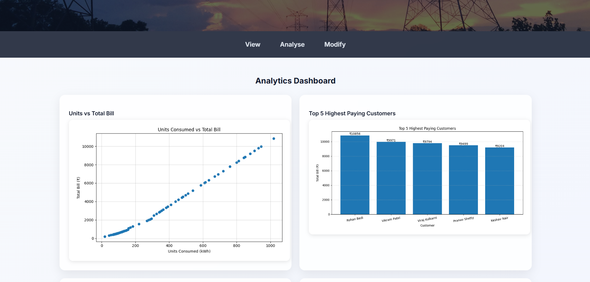

# Utility Billing Analytics - Version 8

## Objective
Modular python-based Flask web application for Utility Billing management and analysis. Modular structure with nirtual environment setup.

## Features
- Multi-column csv file to get varied data
- Reads customer data from CSV file, calculates bill, tax, discount, and penalty
- Modular code structure (separation of logic, config, and execution)
- A multi-page Flask webapp with universal styles
- virtual environment for managing dependencies

## Configuration

### Slab Rates

- 0-100 units → ₹5/unit
- 101-300 units → ₹7/unit
- Above 300 units → ₹10/unit

### Fixed Charge

- ₹100 (added to every bill)

### Discount

- 10% for a bill of less than ₹2000

### taxes

- 18% above ₹1000
- 5% below ₹1000

### Penalty

- 2% of bill amount per day after 15th of next month(due date)
- Max penalty of ₹500

## Data Storage

Customer data is stored in a CSV file with the following fields:

- Customer id
- Customer Name
- Billing month
- Units Consumed
- Payment Status
- Customer type

## Modules & Files

- src → handles logic and reusable code. Contains billing.py(calculation), analytics.py(to generate analysis) and utils.py(helper functions)
- data → contains csv and text files to be used for analysis
- templates → carries html files to display on webapp
- static → stores reports and images to used on webapp
- config.py → stores constant values like rates and slabs
- app.py → flow of the app which runs the final output
- venv → handles virtual environment setup to manage dependencies
- .gitignore → to prevent Git from tracking, staging, or committing unnecessary files—like logs, build artifacts, or secret keys—keeping the repository clean and secure.

## Sample Output

### Landing Page

### View Tab

### Analyze Tab

### Modify Tab
