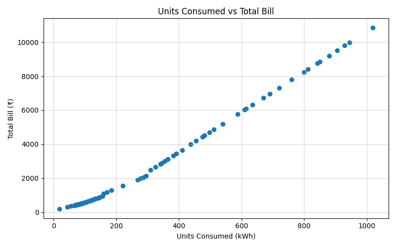
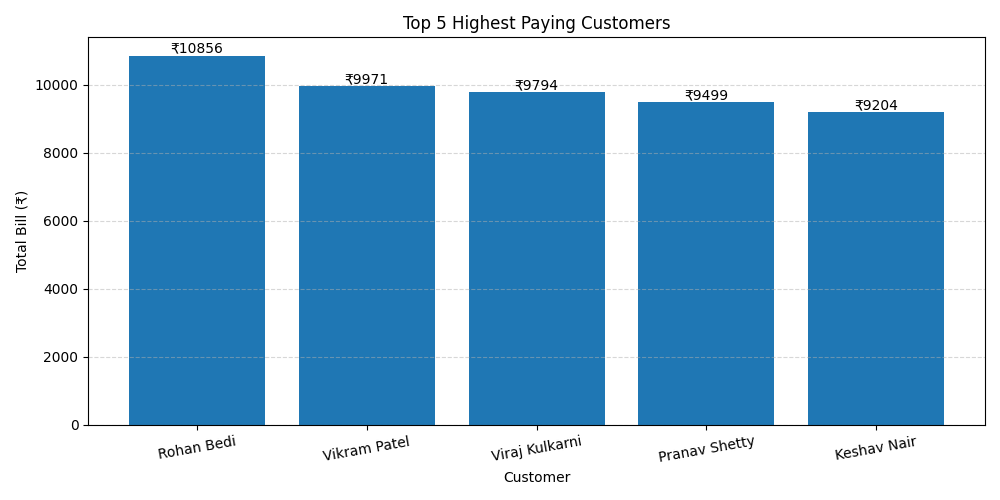
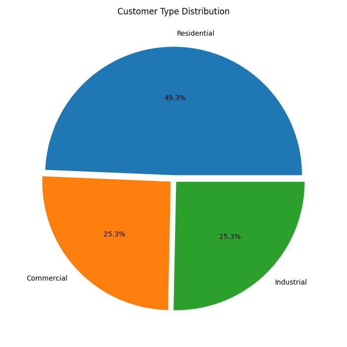
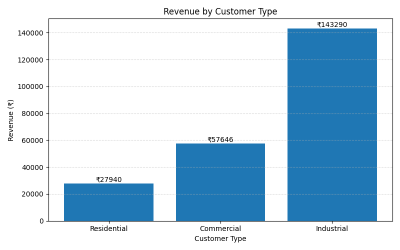
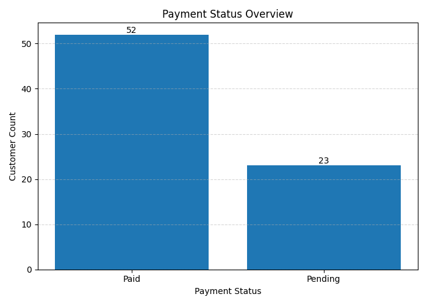
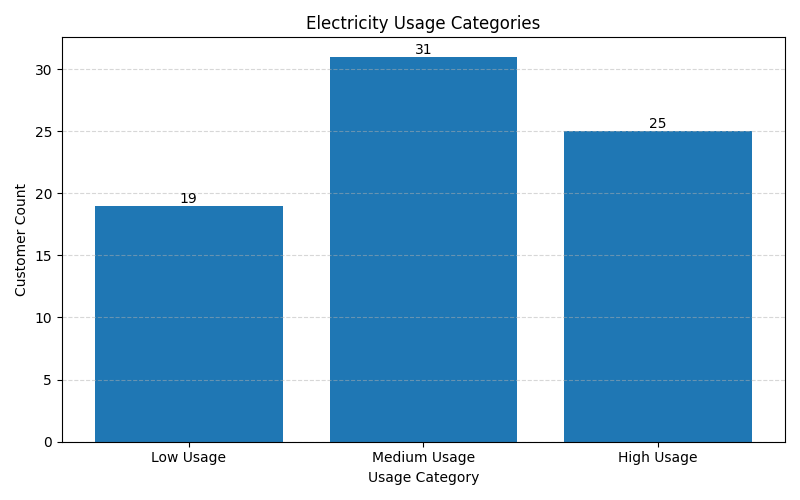
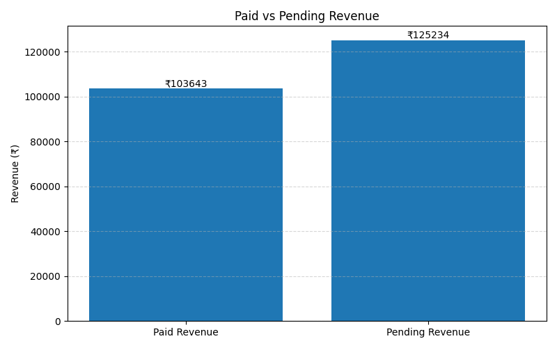
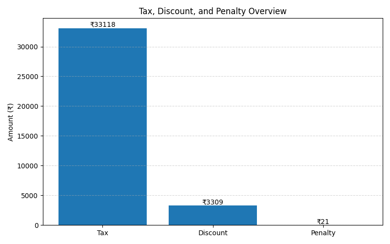
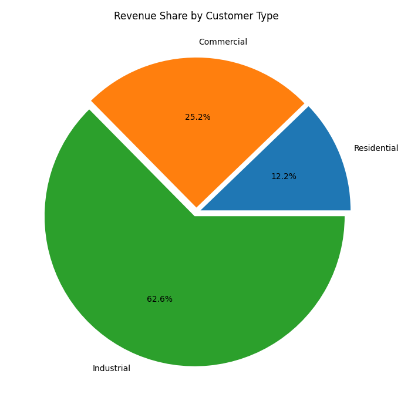

# Utility Billing Analytics - Version 8

## Objective
Built a modular Python-based utility billing system that calculates electricity bills based on taxes, discount, late penalty,etc. It also tracks due date, payment status, and alerts in case of overdue. It also provides charts to present data effectively

## Features
- Multi-column csv file to get varied data
- Reads customer data from CSV file, calculates bill, tax, discount, and penalty
- Handles errors for missing files and invalid data
- Modular code structure (separation of logic, config, and execution)
- Presents analytics like average consumption, max/min bills, etc
- Generates insights based on due date, payment status, and more
- Creats multiple bar graphs and pie charts to analyse data

## Configuration

### Slab Rates

- 0-100 units → ₹5/unit
- 101-300 units → ₹7/unit
- Above 300 units → ₹10/unit

### Fixed Charge

₹100 (added to every bill)

## Data Storage

Customer data is stored in a CSV file with the following fields:

- Customer id
- Customer Name
- Billing month
- Units Consumed
- Payment Status
- Customer type

## Modules & Files

- src → handles logic and reusable code. Contains billing.py(calculation), analytics.py(to generate analysis) and utils.py(helper functions)
- tests → contains multiple sample codes to test individual aspects of the project
- data → contains csv and text files to be used for analysis
- config.py → stores constant values like rates and slabs
- main.py → flow of the app which runs the final output
- .gitignore → to prevent Git from tracking, staging, or committing unnecessary files—like logs, build artifacts, or secret keys—keeping the repository clean and secure.

## Error Handling

### FileNotFoundError
Displayed when the customer CSV file is missing.

### ValueError
Displayed when invalid data is found in the CSV file.

### ValueError in row
Displayed if Units value is less than zero or non integer type

### Missing data in row
Displayed if name or units is not given

## Sample Output

             UTILITY BILLING ANALYTICS REPORT

{generates report with all data}

### Units vs Bill

### Top 5 Customers

### Customer Distribution

### Revenue by Customer Type

### Payment Status

### Usage Distribution

### Paid vs Pending Revenue

### Tax, Discount, and Penalty Overview

### Revenue Share by Customer Type

