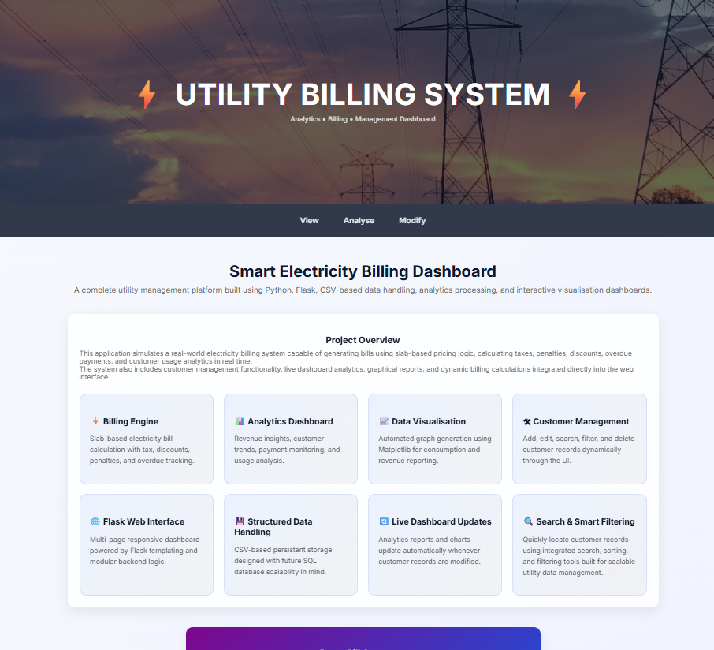
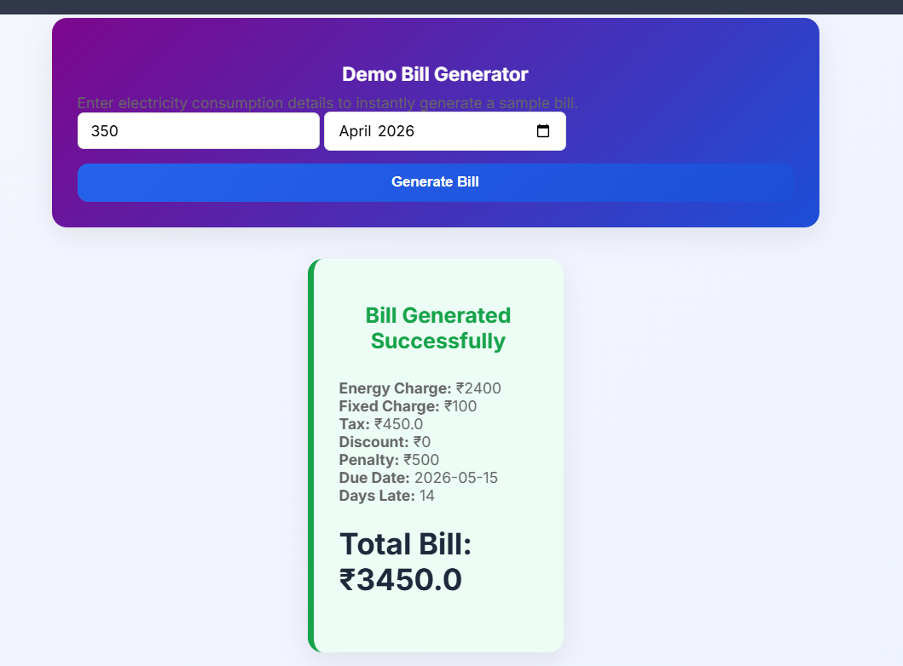
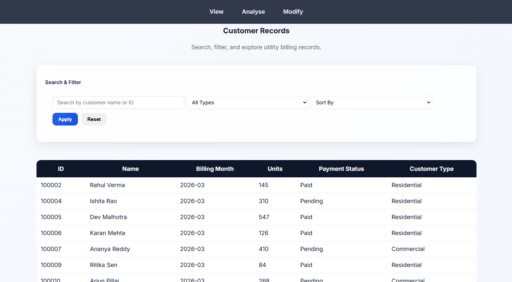
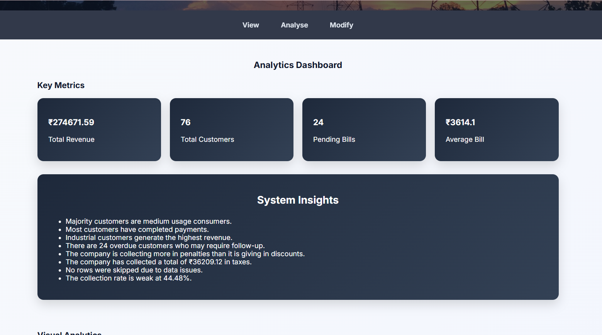
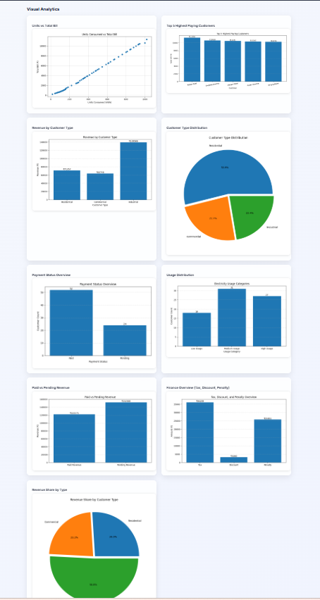
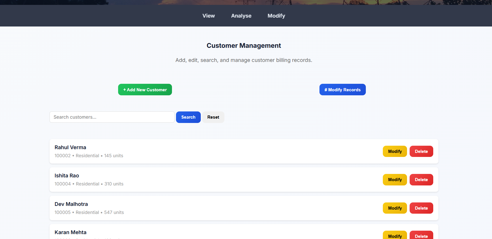
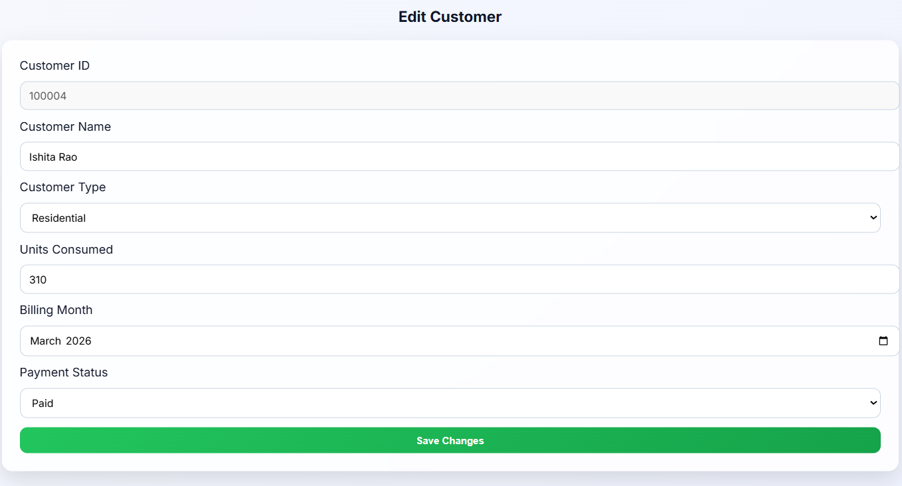
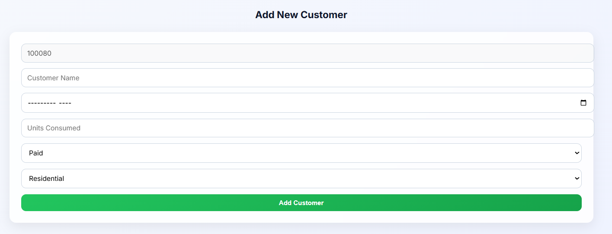

# ⚡ Utility Billing Analytics System

## 📌 Objective

Simulates a real-world electricity utility billing system capable of generating bills, managing customer records, analysing consumption patterns, and visualising billing insights through an interactive web dashboard. Developed using Python and Flask.

---

## ✨ Features

### ⚡ Smart Billing Engine
- Slab-based electricity bill calculation
- Fixed charge implementation
- Tax, discount, and penalty calculation
- Due-date and late-payment handling

### 🌐 Interactive Flask Web Application
- Multi-page Flask dashboard
- Responsive and modern UI design
- Search, sort and filter functionality

### 📊 Analytics & Visualisation
- Automated graph generation using Matplotlib
- Revenue and customer analysis dashboards
- Live analytics and chart updates after data modification

### 🛠 Customer Management System
- Add, edit or delete customer records
- Auto-generated customer IDs
- Form-based data handling

### 💾 Structured Data Handling
- CSV-based persistent storage
- Modular file organization

---

## 🛠 Technologies Used

Python | Flask | HTML5 | CSS3 | Matplotlib | CSV File Handling | Git & GitHub

---

## 📂 Project Structure

```bash
Utility-Billing-System/
│
├── app.py
├── config.py
├── data/
│   └── customers.csv
├── src/
│   ├── billing.py
│   ├── analytics.py
│   ├── visualisations.py
│   └── utils.py
├── static/
│   ├── charts/
│   ├── images/
│   └── styles.css
├── templates/
│   ├── base.html
│   ├── index.html
│   ├── view.html
│   ├── analyze.html
│   └── modify.html
└── README.md

```
## 📸 Output Screens

### 🏠 Landing Page


---

### ⚡ Bill Generation


---

### 📋 View Tab


---

### 📊 Analytics Dashboard - Overview


---

### 📈 Analytics Dashboard - Visualisations


---

### 🛠 Modify Customers


---

### ✏ Edit Customer


---

### ➕ Add Customer


---

## 👩‍💻 Developed By

**Navya K. Vithalani**  
Internship Project — Abjayon